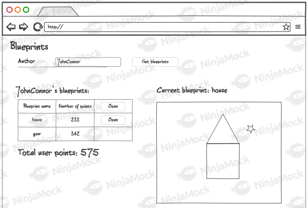

# Ejercicio: Diseño de un Cliente Web Básico

## Descripción
El objetivo de este ejercicio es diseñar un cliente web básico utilizando los lenguajes **HTML**, **JavaScript** y **CSS**. Este proyecto se dividirá en dos partes, las cuales están descritas en los siguientes vinculos:

### Escuela Colombiana de Ingeniería
### Arquiecturas de Software

## Explicación del cliente web realizado
La página se encuentra en http://localhost:8080/index.html. Los autores disponibles para buscar son "Juan" y "David".

Para modificar un plano basta con abrirlo y empezar a dibujar sobre el canvas, cada click crea un punto nuevo dentro del plano. Para guardar los cambios se debe oprimir el botón "Update Blueprint".

Para crear un nuevo plano se debe tener cargado el autor al que se le quiere añadir, antes de oprimir el botón "Create Blueprint" se debe escribir un nombre en el espacio destinado. Luego de crearlo se debe abrir el plano y en ese momento ya se puede dibujar sobre el canvas.

Para eliminar un plano basta con abrirlo y oprimir el botón "Delete Blueprint", ya no se podrá acceder a un autor una vez se quede sin planos.

-[Parte 1](https://github.com/ARSW-ECI-archive/HTML5-JS_REST_CLIENT_Blueprints-1)

## Construción de un cliente 'grueso' con un API REST, HTML5, Javascript y CSS3. Parte I.

### Trabajo individual o en parejas. A quienes tuvieron malos resultados en el parcial anterior se les recomienda hacerlo individualmente.

1. Al oprimir 'Get blueprints', consulta los planos del usuario dado en el formulario. Por ahora, si la consulta genera un error, sencillamente no se mostrará nada.
2. Al hacer una consulta exitosa, se debe mostrar un mensaje que incluya el nombre del autor, y una tabla con: el nombre de cada plano de autor, el número de puntos del mismo, y un botón para abrirlo. Al final, se debe mostrar el total de puntos de todos los planos (suponga, por ejemplo, que la aplicación tienen un modelo de pago que requiere dicha información).
3. Al seleccionar uno de los planos, se debe mostrar el dibujo del mismo. Por ahora, el dibujo será simplemente una secuencia de segmentos de recta realizada en el mismo orden en el que vengan los puntos.

***
-[Parte 2](https://github.com/ARSW-ECI-archive/HTML5-JS_REST_CLIENT_Blueprints-2)

## Construción de un cliente 'grueso' con un API REST, HTML5, Javascript y CSS3. Parte II.

1. Agregue al canvas de la página un manejador de eventos que permita capturar los 'clicks' realizados, bien sea a través del mouse, o a través de una pantalla táctil. Para esto, tenga en cuenta [este ejemplo de uso de los eventos de tipo 'PointerEvent'](https://mobiforge.com/design-development/html5-pointer-events-api-combining-touch-mouse-and-pen) (aún no soportado por todos los navegadores) para este fin. 

2. Agregue lo que haga falta en sus módulos para que cuando se capturen nuevos puntos en el canvas abierto (si no se ha seleccionado un canvas NO se debe hacer nada):
    1. Se agregue el punto al final de la secuencia de puntos del canvas actual (sólo en la memoria de la aplicación, AÚN NO EN EL API!).
    2. Se repinte el dibujo.

3. Agregue el botón Save/Update. Respetando la arquitectura de módulos actual del cliente, haga que al oprimirse el botón:
    1. Se haga PUT al API, con el plano actualizado, en su recurso REST correspondiente.
    2. Se haga GET al recurso /blueprints, para obtener de nuevo todos los planos realizados.
    3. Se calculen nuevamente los puntos totales del usuario.

4. Agregue el botón 'Create new blueprint', de manera que cuando se oprima:
    * Se borre el canvas actual.
    * Se solicite el nombre del nuevo 'blueprint' (usted decide la manera de hacerlo).

   Esta opción debe cambiar la manera como funciona la opción 'save/update', pues en este caso, al oprimirse la primera vez debe (igualmente, usando promesas):

    1. Hacer POST al recurso /blueprints, para crear el nuevo plano.
    2. Hacer GET a este mismo recurso, para actualizar el listado de planos y el puntaje del usuario.

5. Agregue el botón 'DELETE', de manera que (también con promesas):
    * Borre el canvas.
    * Haga DELETE del recurso correspondiente.
    * Haga GET de los planos ahora disponibles.

## Criterios de evaluación

1. Funcional
    * La aplicación carga y dibuja correctamente los planos.
    * La aplicación actualiza la lista de planos cuando se crea y almacena (a través del API) uno nuevo.
    * La aplicación permite modificar planos existentes.
    * La aplicación calcula correctamente los puntos totales.
2. Diseño
    * Los callback usados al momento de cargar los planos y calcular los puntos de un autor NO hace uso de ciclos, sino de operaciones map/reduce.
    * Las operaciones de actualización y borrado hacen uso de promesas para garantizar que el cálculo del puntaje se realice sólo hasta cando se hayan actualizados los datos en el backend. Si se usan callbacks anidados se evalúa como R.

## Entrega
- Deben entregar el código fuente completo y un archivo **README** explicando el funcionamiento de su cliente web.
- Asegúrense de probar su proyecto en diferentes navegadores para verificar su compatibilidad.
  
El plazo de entrega es el descrito en la tarea de teams.

¡Éxito con el desarrollo de su cliente web!

### Milton Gutiérrez | Juan David Contreras